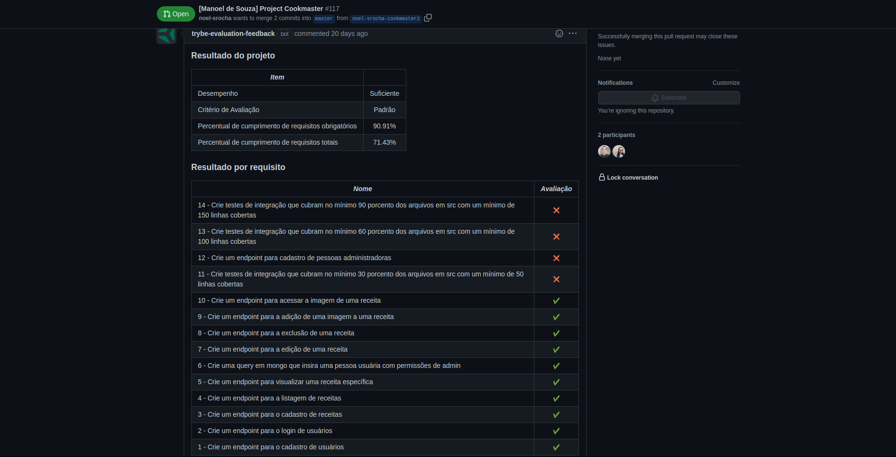

# Project Cookmaster

### The Assignment

You will develop your app using the MSC architecture!

In this new project it should be possible to register and login users, where only these people will be able to access, modify and delete the recipes they have registered.

### Skills to be Tested

In this project, I was able to:

- Understand what's inside an authentication token;

- Generate tokens from information such as login and password;

- Authenticate Express routes, using the JWT token;

- Upload files in REST APIs;

- Save files on the server through a REST API;

- Query server files through a REST api.

- Perform integration tests

### Evaluator Results

#### Disclaimer

This assignment was developed by [Trybe](https://www.betrybe.com) in order to test my skills with developing REST and RESTful APIs with Node.js and Express.js.